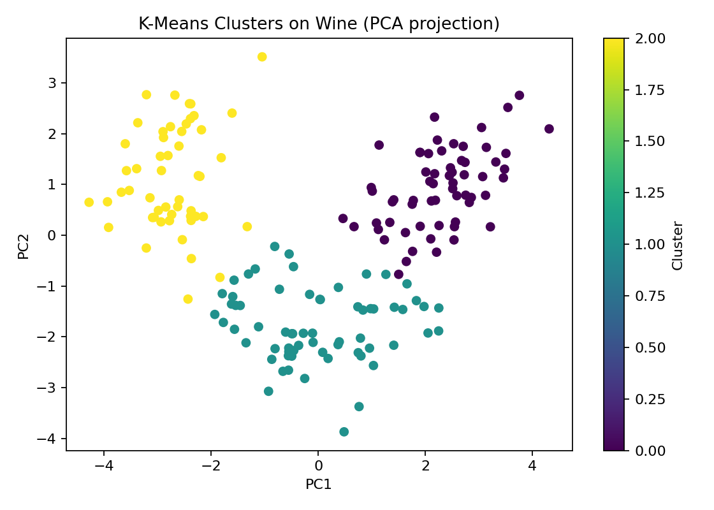
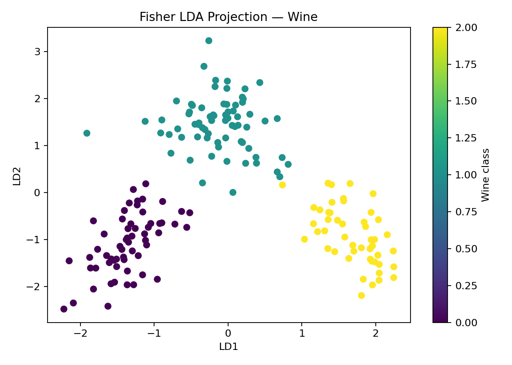
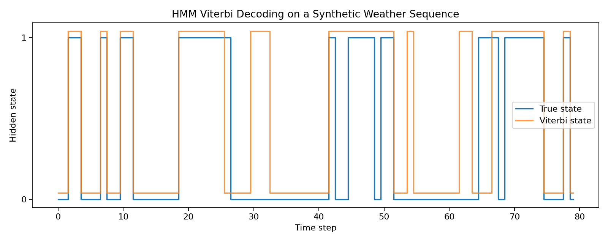

# Pattern Recognition from Scratch

> Classical pattern recognition algorithms implemented from scratch with NumPy, with reproducible experiments on standard datasets.

[](https://github.com/Waldo0926/pattern-recognition-from-scratch/actions/workflows/ci.yml)


**English** · [中文](README.zh-CN.md)

This repository revisits material from an undergraduate **Pattern Recognition** course and turns it into a small, testable implementation library. The original coursework included hands-on experiments with Gaussian Naive Bayes, multiclass Perceptron, K-Means, and Fuzzy C-Means; Fisher LDA and Hidden Markov Models were also covered in the course and are implemented here as later extensions.

The emphasis is not on wrapping scikit-learn. The algorithms in `prlib/` implement the core mathematics directly with NumPy (plus SciPy only for optimal cluster-label assignment in evaluation). Scikit-learn is used in the experiment layer for datasets, preprocessing, visualisation support, and reference comparisons.

## Highlights

- **Six classical algorithms:** Gaussian Naive Bayes, multiclass Perceptron, K-Means, Fuzzy C-Means, Fisher LDA, and a discrete HMM.
- **Numerically safer implementations:** log-domain Naive Bayes, variance smoothing, scaled Forward/Backward HMM recursions, and regularized Fisher LDA.
- **Correct clustering evaluation:** ARI/NMI and optimal label matching rather than assuming cluster IDs equal class labels.
- **Reproducible experiments:** fixed random seeds, stratified train/test splits, saved figures, and comparison against scikit-learn where an equivalent implementation exists.
- **Tested codebase:** 21 automated tests covering controlled examples, reference comparisons, reproducibility, and edge cases.

## Algorithms and coursework scope

| Algorithm | Category | Covered in course | Original coursework experiment | Reimplemented here |
|---|---|:---:|:---:|:---:|
| Gaussian Naive Bayes | Probabilistic classification | ✓ | ✓ | ✓ |
| Multiclass Perceptron | Linear classification | ✓ | ✓ | ✓ |
| Fisher LDA | Discriminant analysis | ✓ | — | ✓ |
| K-Means | Hard clustering | ✓ | ✓ | ✓ |
| Fuzzy C-Means | Soft clustering | ✓ | ✓ | ✓ |
| Hidden Markov Model | Sequence modelling | ✓ | — | ✓ |

See [`docs/coursework-lineage.md`](docs/coursework-lineage.md) for a precise explanation of what came from the original coursework and what was rebuilt or extended later.

## Results

A reproducible snapshot from the experiment scripts:

| Algorithm | Dataset / task | From-scratch result | Reference |
|---|---|---:|---:|
| Gaussian Naive Bayes | Digits | **82.89%** accuracy | sklearn: **82.89%** |
| Multiclass Perceptron | Digits | **94.67%** accuracy | sklearn: **93.11%** |
| K-Means | Wine | **0.8975 ARI**, 96.63% matched accuracy | sklearn ARI: **0.8975** |
| Fuzzy C-Means | Wine | **0.8975 ARI**, 96.63% matched accuracy | — |
| Fisher LDA + nearest centroid | Wine | **100.00%** accuracy | sklearn LDA: **95.56%** |
| HMM | Synthetic sequence | **83.33%** matched hidden-state accuracy | known generating model |

The numbers are educational benchmarks on fixed splits/seeds, not claims of state-of-the-art performance. See [`results/benchmarks.md`](results/benchmarks.md) for details and runtime notes.

### Representative figures

#### K-Means on Wine



#### Fisher LDA projection



#### HMM Viterbi decoding



## Quick start

```bash
git clone https://github.com/Waldo0926/pattern-recognition-from-scratch.git
cd pattern-recognition-from-scratch

python -m venv .venv
source .venv/bin/activate  # Windows: .venv\Scripts\activate

python -m pip install --upgrade pip
python -m pip install -e ".[dev]"
pytest
```

Run any experiment directly after installing the project:

```bash
python experiments/exp01_naive_bayes_digits.py
python experiments/exp02_perceptron_digits.py
python experiments/exp03_kmeans_wine.py
python experiments/exp04_fuzzy_cmeans_wine.py
python experiments/exp05_lda_wine.py
python experiments/exp06_hmm_weather.py
```

Figures are written to `results/figures/`.

## Project structure

```text
pattern-recognition-from-scratch/
├── prlib/                  # NumPy-first algorithm implementations
│   ├── naive_bayes.py
│   ├── perceptron.py
│   ├── kmeans.py
│   ├── fuzzy_cmeans.py
│   ├── lda.py
│   ├── hmm.py
│   └── metrics.py
├── experiments/            # Reproducible benchmark/demo scripts
├── tests/                  # Pytest suite
├── results/
│   ├── figures/
│   └── benchmarks.md
├── docs/
│   ├── algorithms.md
│   └── coursework-lineage.md
├── data/                   # Clean copy of the Wine data used historically
├── .github/workflows/ci.yml
├── pyproject.toml
└── requirements.txt
```

## Implementation notes

### Gaussian Naive Bayes

The original classroom implementation multiplied 64 Gaussian densities directly. This rewrite performs the calculation in the **log domain**, which avoids floating-point underflow and makes the numerical reasoning explicit.

### Multiclass Perceptron

Each class owns a weight vector. If the highest-scoring class is incorrect, the true class is moved toward the sample and the predicted class is moved away from it. The implementation records training mistakes by epoch for inspection.

### K-Means and Fuzzy C-Means

K-Means uses **k-means++** initialization. FCM retains a full membership matrix so uncertainty is visible rather than discarded. Because cluster numbers are arbitrary, the evaluation does not compare raw cluster IDs with class IDs.

### Fisher LDA

The implementation builds within-class and between-class scatter matrices, solves the discriminant eigensystem, projects into at most `n_classes - 1` dimensions, and classifies by nearest centroid in that subspace.

### Hidden Markov Model

The discrete HMM includes the three classic problems: **Forward** evaluation, **Viterbi** decoding, and **Baum-Welch** parameter learning. Forward/Backward calculations are scaled to remain numerically stable on longer sequences.

For the derivations and equations, see [`docs/algorithms.md`](docs/algorithms.md).

## Datasets

- **Digits:** loaded from `sklearn.datasets.load_digits()`.
- **Wine:** loaded from `sklearn.datasets.load_wine()` in experiments. A cleaned UTF-8 copy of the dataset used in the historical coursework is kept in `data/wine.csv` for traceability.
- **HMM demo:** synthetic categorical sequences generated from a known two-state model, allowing decoded states and Baum-Welch learning behavior to be checked.

## Why this repository is structured this way

This is intentionally **not** a course-material archive. Lecture slides, answer sheets, temporary files, local virtual environments, personal identifiers, and third-party documents are not included. The repository focuses on code that can be executed, explained, tested, and reproduced.

## License

Code in this repository is released under the [MIT License](LICENSE). Dataset provenance is described separately in [`data/README.md`](data/README.md).
